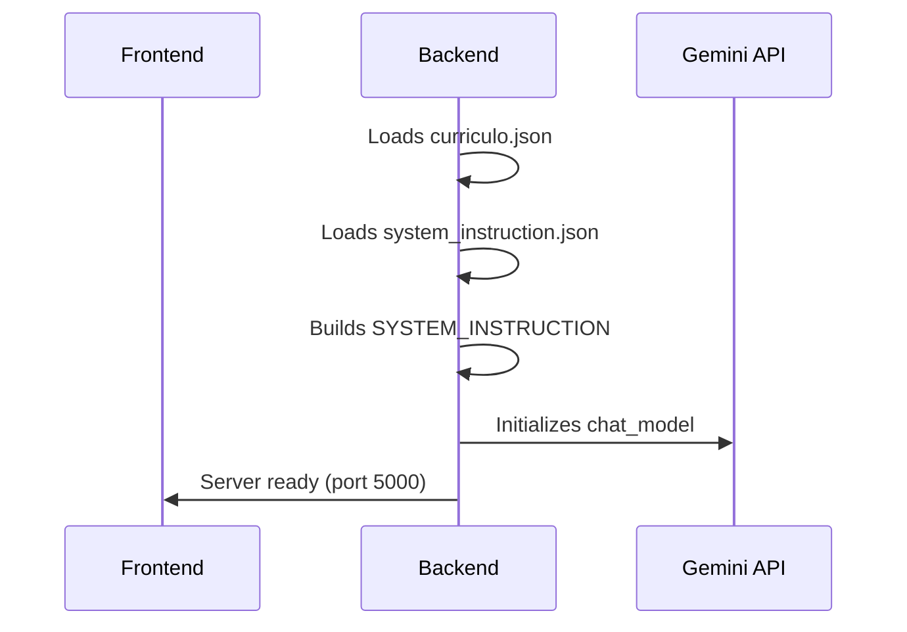
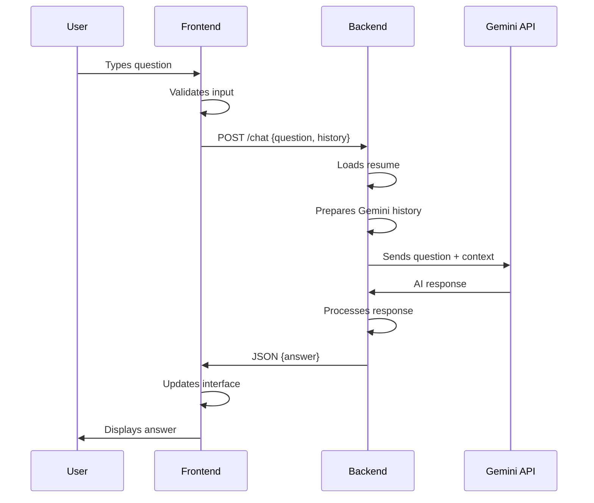

# 📚 Technical Documentation - Gemini ChatBot

## 🔧 System Architecture

### Architecture Overview

```
┌─────────────────┐    HTTP/JSON    ┌─────────────────┐
│   Frontend      │ ◄─────────────► │    Backend      │
│   (React)       │                 │   (Flask)       │
└─────────────────┘                 └─────────────────┘
                                              │
                                              ▼
                                    ┌─────────────────┐
                                    │  Google Gemini  │
                                    │      API        │
                                    └─────────────────┘
```

### Main Components

#### 1. Frontend (React)
- **Technology**: React 19.1.0
- **Styling**: TailwindCSS
- **HTTP Client**: Axios
- **State Management**: React Hooks (useState, useContext)
- **Roles System**: RoleContext, RoleSelector, RoleCard

#### 2. Backend (Flask)
- **Technology**: Python Flask
- **AI**: Google Gemini API
- **Data**: Structured JSON
- **CORS**: Flask-CORS
- **Roles System**: RoleHandler, JSON role files

#### 3. Knowledge Base
- **Format**: Structured JSON
- **Location**: `backend/data/curriculo.json`
- **Instructions**: `backend/data/system_instruction.json`
- **Roles**: `backend/data/roles/`

## 🎭 Roles System

### Overview

The roles system allows customizing the chatbot's answers according to the user's profile (e.g., recruiter, developer, student, client). Each role has its own instructions and example questions.

### Roles Structure

#### File Locations
```
backend/
├── data/
│   ├── roles/
│   │   ├── recruiter.json
│   │   ├── developer.json
│   │   ├── student.json
│   │   └── client.json
│   └── ...
└── utils/
    └── role_handler.py
```

#### Structure of a Role File

```json
{
  "id": "recruiter",
  "name": "Recruiter",
  "icon": "🕵️‍♂️",
  "color": "#8b5cf6",
  "description": "Recruiter profile, seeks objective and professional information.",
  "examples": [
    "What are Lucas's main skills?",
    "Does he have international experience?",
    "What is his English level?",
    "Does he have experience with team projects?"
  ],
  "instructions": {
    "focus": "Professional and objective information",
    "tone": "Formal and direct",
    "priorities": [
      "Professional experience",
      "Technical skills",
      "Education and certifications",
      "Availability and location"
    ]
  }
}
```

### Roles Endpoints

#### GET `/roles`
**Description**: Returns all available roles

**Response**:
```json
{
  "roles": [
    {
      "id": "recruiter",
      "name": "Recruiter",
      "icon": "🕵️‍♂️",
      "color": "#8b5cf6",
      "description": "Recruiter profile, seeks objective and professional information."
    },
    {
      "id": "developer",
      "name": "Developer",
      "icon": "👨‍💻",
      "color": "#3b82f6",
      "description": "Technical profile, focuses on programming skills and projects."
    }
  ]
}
```

#### GET `/roles/<role_id>/examples`
**Description**: Returns example questions for a specific role

**Response**:
```json
{
  "examples": [
    "What are Lucas's main skills?",
    "Does he have international experience?",
    "What is his English level?",
    "Does he have experience with team projects?"
  ]
}
```

### How to Add a New Role

#### 1. Create JSON File
Create a new file in `backend/data/roles/` following the pattern:

```json
{
  "id": "new_role",
  "name": "New Role",
  "icon": "🎯",
  "color": "#10b981",
  "description": "Description of the new role",
  "examples": [
    "Example question 1",
    "Example question 2"
  ],
  "instructions": {
    "focus": "Role focus",
    "tone": "Communication tone",
    "priorities": [
      "Priority 1",
      "Priority 2"
    ]
  }
}
```

#### 2. Restart Backend
The system automatically loads available roles. Just restart the backend.

### Chat Integration

#### Modified Request
The `/chat` endpoint now accepts the `role` parameter:

```json
{
  "question": "string",
  "history": [...],
  "role": "recruiter"
}
```

#### Modified Response
```json
{
  "answer": "string",
  "role": "recruiter"
}
```

### Frontend - Roles System

#### Components

1. **RoleContext** (`src/components/RoleContext.js`)
   - Manages global roles state
   - Loads roles from backend
   - Maintains selected role

2. **RoleSelector** (`src/components/RoleSelector.js`)
   - Interface for role selection
   - Displays cards of available roles
   - Allows navigation between roles

3. **RoleCard** (`src/components/RoleCard.js`)
   - Individual card for each role
   - Displays icon, name, and description
   - Visual selection feedback

#### Screen Flow with Roles

```
Welcome → Initial Question → Role Selection → Chat
```

1. **OpeningWindow**: Welcome screen
2. **QuestionWindow**: Transition/initial question screen
3. **RoleSelector**: Profile/role selection
4. **ChatWindow**: Chat with selected role

#### How the Role Affects Behavior

- The frontend sends the selected role in each request
- The backend customizes the answer based on the role's instructions
- The user can change roles during the conversation

## 🗂️ Data Structure

### Resume JSON (`curriculo.json`)

```json
{
  "name": "Lucas Nouman",
  "title": "High School Student | Aspiring Software Engineer",
  "summary": "...",
  "contact": {
    "email": "...",
    "location": "...",
    "github": "...",
    "linkedin": "..."
  },
  "skills": {
    "programming_languages": [...],
    "backend_frameworks": [...],
    "frontend_frameworks": [...],
    "databases": [...],
    "ai_ml_tools": [...],
    "devops_tools": [...],
    "development_tools": [...],
    "concepts": [...]
  },
  "languages": [...],
  "academic_background": [...],
  "professional_experience": [...],
  "projects": [...],
  "certifications": [...],
  "what_im_looking_for": "...",
  "additional_info": {...}
}
```

### System Instructions (`system_instruction.json`)

```json
{
  "sys": [
    {
      "id": "1",
      "role_definition": {...},
      "core_rules": {...},
      "advanced_behaviors": {...}
    }
  ]
}
```

## 🔄 Data Flow

### 1. System Initialization



### 2. Conversation Flow



## 🛠️ APIs and Endpoints

### Backend Endpoints

#### POST `/chat`
**Description**: Main endpoint to process user questions

**Request Body**:
```json
{
  "question": "string",
  "history": [
    {
      "role": "user|model",
      "parts": [{"text": "string"}]
    }
  ]
}
```

**Response**:
```json
{
  "answer": "string"
}
```

**Status Codes**:
- `200`: Success
- `400`: Empty question
- `500`: Internal error

#### POST `/answer`
**Description**: Endpoint to save answers (experimental feature)

**Request Body**:
```json
{
  "answer": "string",
  "setId": "string"
}
```

## 🔧 Configuration

### Environment Variables

```bash
# Backend (.env)
GEMINI_API_KEY=your_api_key_here
FLASK_ENV=development
FLASK_DEBUG=true
```

## 🐛 Troubleshooting

### Common Issues

#### 1. CORS Error
**Symptom**: Browser console error about CORS  
**Solution**: Check Flask-CORS configuration

#### 2. Invalid API Key
**Symptom**: 401 or 403 error from Gemini
**Solution**: Check GEMINI_API_KEY environment variable  

#### 3. Malformed JSON
**Symptom**: Error loading system_instruction.json  
**Solution**: Validate JSON structure with an online validator

#### 4. Frontend does not connect to Backend
**Symptom**: Network error in console  
**Solution**: Check if backend is running on port 5000

### Debug Commands

```bash
# Check if backend is running
curl http://localhost:5000/health

# Test chat endpoint
curl -X POST http://localhost:5000/chat \
  -H "Content-Type: application/json" \
  -d '{"question":"test","history":[]}'

# Check backend logs
tail -f backend/app.log
```

## 📈 Performance

### Implemented Optimizations

1. **System Instructions Cache**: Loaded once at startup
2. **Conversation History**: Kept in memory for context
3. **Input Validation**: Filters before calling Gemini API

## 🔒 Security

### Implemented Measures

1. **Input Validation**: Data sanitization
2. **CORS Configured**: Only allowed origins
3. **Secure API Key**: Stored in environment variables
4. **Scope Filter**: Prevents inappropriate answers 